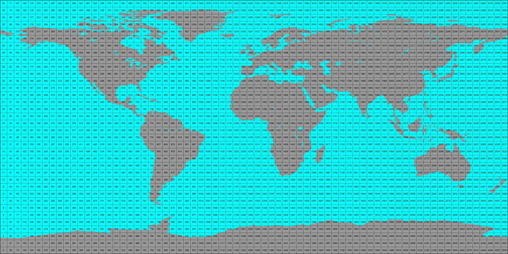
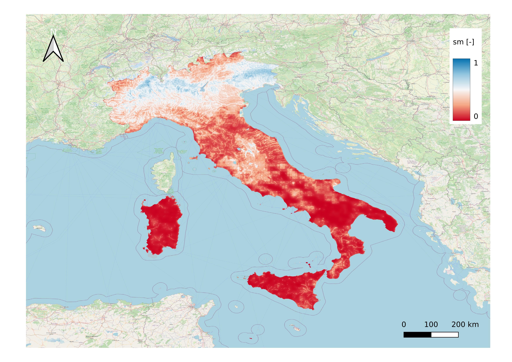

# Triple Collocation Algorithm

Triple collocation is a statistical approach that compares three independent estimates of the same variable (for example, satellite retrievals from SMAP and ASCAT, and model output from GLDAS) to quantify the error variance of each data source without requiring a perfect reference. By analyzing the pairwise cross-covariances among the three datasets, it derives unbiased estimates of each product’s random errors, helping to assess reliability and \$1

**Script Location:** `recolour/app_cell/compute_cell_tc/app_cell_tc.py`

## Input

Before processing, the study area is divided into 5×5° geographic cells. Each cell is numbered according to its grid row and column and processed independently by the Triple Collocation workflow. This partitioning improves computational efficiency and allows regional error statistics to be derived.

> **Figure:** Global 5×5° cells grid overlaying the study domain. Each cell spans 5° latitude and longitude, numbered by row/column, enabling independent processing of regional statistics.

### Static Datasets

- **Cell Grid Sources** (from `datasets.static.source.cell_grid`):

  - `ref`: reference dataset (e.g., HMC) for collocation.
  - `k1`: first other dataset (e.g., ECMWF).
  - `k2`: second other datasets (e.g., SMAP).

- **Geographic Grid** (from `datasets.static.source.geo_grid`):

  - spatial reference grid (GeoTIFF).

### Dynamic Datasets

- **Soil Moisture Time Series** (from `datasets.dynamic.source.soil_moisture`):

  - `ref`: dynamic cell-level SM for reference.
  - `k1`: dynamic cell-level SM for dataset `k1`.
  - `k2`: dynamic cell-level SM for dataset `k2`.

  Each time series dataset contains variables/features such as `soil_moisture_ref`, `soil_moisture_k1`, `soil_moisture_k2`, `time`, `lon`, and `lat`.

- **Weights** (from `datasets.dynamic.source.weights`):

  - `ref_k1`: weight array for reference vs k1 comparisons.
  - `ref_k2`: weight array for reference vs k2 comparisons.
  - `k1_k2`: weight array for k1 vs k2 comparisons.

## Ancillary

- **Points** (`datasets.dynamic.ancillary.points`):
  - cell-based ancillary point (raw, analyzed and metrics).
- **Maps** (`datasets.dynamic.ancillary.maps`):
  - cell-based ancillary maps.

## Output

- **Dynamic Output** (from `datasets.dynamic.destination`):
  - `soil_moisture_masked_resampled`: resampled and masked soil moisture map.
  - `soil_moisture_masked_filtered`: filtered soil moisture map.
  - `flags_masked`: datasets flags map.

> **Figure:** Soil moisture results for the Italy domain. Processing time is extracted from the output GeoTIFF filename (`sm_{datetime_destination}.tiff`), e.g., **2025-06-01 00:00 UTC**. The reference grid resolution is about 500 m, and the datasets used are HMC, ECMWF, and SMAP.

All saved as GeoTIFF `sm_{datetime_destination}.tiff` to the destination folder.

